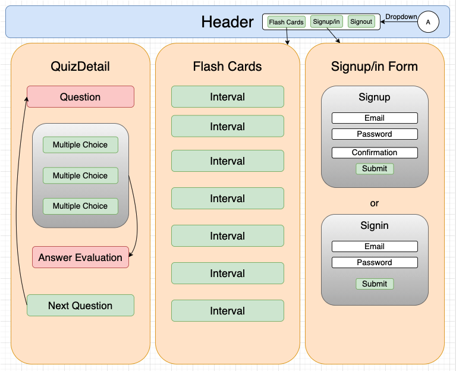

# _Intervals Ear Trainer_
A React web app for studying musical intervals and chords.

### _**Andy Lawson**_

[Epicodus](https://www.epicodus.com/) - [Independent Capstone Projects](https://www.learnhowtoprogram.com/react/independent-capstone-projects)

#### Date created: 05/7/2021-Present

---

## Technologies Used

* _React_
* _JSX_
* _useSound hook_
* _Firebase_
* _styled-components_
* _draw.io_
* _git_

---

## User Stories

* As a user, I want to hear a specific interval, triad, or 7th chord when I click a flash card.
* As a user I want to test my skills by taking a multiple choice quiz with different intervals and chords.

## Component Diagram
Diagram showing parent and children components and how they will be structured in relation to one another:

---

## Setup/Installation

* To clone this directory, navigate in your terminal to the desired location of the project and run command `git clone https://github.com/andyL89/intervals-ear-trainer`
* Navigate to top level of the directory with command `cd intervals-ear-trainer`
* Run local server with command `npm run start`

---

## Editing Instructions

* To use Visual Studio Code to edit this project, follow install instructions [here](https://code.visualstudio.com/).
* To enable command `code`, open VS Code, click on View > Command Palette, type in "shell command", and click on "Shell Command: Install 'code' command in PATH"
* Now, from your terminal, in the project's top level directory, you can run command `code .` to open project in VS Code.

---

## License

[MIT](LICENSE.txt)

---

## Contact Information

* _Contact Andy via [Email](mailto:alawson89@gmail.com) or [LinkedIn](https://www.linkedin.com/in/andrew-lawson-dev/), or check out his [Github](https://github.com/andyL89)._